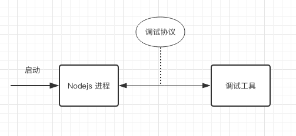
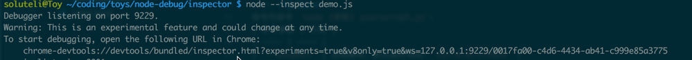
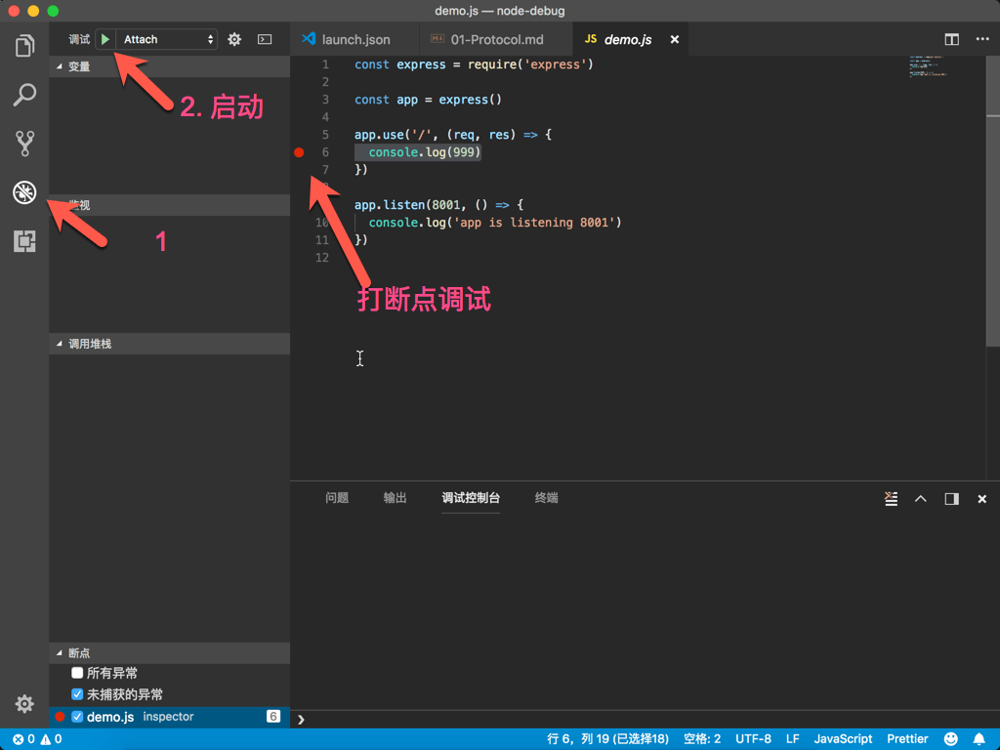

# JavaScript 调试 —— Node.js 调试协议
## 图解 Node.js 调试
下图是 Node.js 调试过程的解析图  
   
**简要分析**  
1. 调试协议是实现程序可调试的核心。   
2. 启用调试模式，Node.js 会开放特定端口，使用**调试工具**接入该端口后就可以调试。

## 调试协议
现在主要有两种调试协议：
- **legacy**: 基于 [V8 Debugger Protocol](https://github.com/buggerjs/bugger-v8-client/blob/master/PROTOCOL.md)。应用于旧版本。
- **inspector**: 基于 [V8 Inspector Protocol](https://chromedevtools.github.io/debugger-protocol-viewer/v8/)。应用于新版本（>=6.3）,修复了旧协议的一些问题。使用时需要加上 `--inspect` 参数。

**协议对比**   
<table class="table table-striped"> <thead> <tr> <th>Runtime</th> <th>'Legacy' Protocol</th> <th>'Inspector' Protocol</th> </tr> </thead> <tbody> <tr> <td>io.js</td> <td>all</td> <td>no</td> </tr> <tr> <td>node.js</td> <td>&lt; 8.x</td> <td>&gt;= 6.3 (Windows: &gt;= 6.9)</td> </tr> <tr> <td>Electron</td> <td>&lt; 1.7.4</td> <td>&gt;= 1.7.4</td> </tr> <tr> <td>Chakra</td> <td>all</td> <td>not yet</td> </tr> </tbody> </table>

官方建议我们优先选用 **inspector** 协议，因为它修复了旧协议的已知 Bug。  

## 搭建调试环境 

我们接下来介绍怎样搭建 **inspector** 协议调试环境。
### **inspector** 协议的调试环境
> [V8 Inspector Protocol](https://chromedevtools.github.io/debugger-protocol-viewer/v8/) 使用 websocket (通常是9929端口) 与 Client/IDE 交互，同时基于 Chrome/Chromium 的浏览器提供了图形化调试界面。

**开启调试的命令介绍**   

命令示例： `node [参数] yourscript.js`：

| 命令参数 | 介绍 |
| ---- | ---- |
| `--inspect` | 启动脚本，默认监听地址：`127.0.0.1:9929` |
| `--inspect=[post:port]` | 启动脚本，指定监听地址（`host` 默认为 `127.0.0.1`, `port` 默认为 `9929`）。 |
| `--inspect-brk` | 启动脚本，脚本执行前自动断点。默认监听地址：`127.0.0.1:9929`。 |
| `--inspect-brk=[post:port]` | 启动脚本，脚本执行前自动断点。指定监听地址（`host` 默认为 `127.0.0.1`, `port` 默认为 `9929`）。 |
| `node inspect yourscript.js` | 命令行调试：子进程使用 `--inspect`。主进程使用命令行调试工具 |
| `node inspect --port=xxx yourscript.js` | 命令行调试：子进程使用 `--inspect`, 指定端口（默认：9929）。主进程使用命令行调试工具。 |

## 接入调试工具
我们开启调试后，就可以使用工具接入端口进行调试了，下面介绍几种调试工具的介入方法：   

**1. Chrome DevTools**   
执行调试命令（如：`node --inpect yourscript.js`）后，Chrome 中打开命令行中提示的地址即可：


**2. vscode**   
vscode 内置了 Node.js 的调试工具，简化了调试前的的配置。   
配置 `.vscode/launch.json`:
```
{
  "type": "node",
  "request": "launch",
  "name": "Demo",
  "program": "${workspaceFolder}/inspector/demo.js",
}
```
操作步骤：
   

其它的 IDE 工具比如 `webstorm` 都有内置的调试工具，具体的方法请参照它们的文档。

## 常见问题
1. 执行调试命令（如：`node --inpect yourscript.js`）后，Chrome 中打开命令行中提示的调试地址不能正确打开调试面板。   
  解决办法：如果不是有监听端口的程序，执行之后进程就释放。调试这类程序要使用 `--inpect-brk` 参数，在程序执行前自动加断点。

## 参考链接
- [Node 调试指南 —— Inspector 协议](https://zhuanlan.zhihu.com/p/30264842)
- [Node 官网介绍的 Inspector ](https://nodejs.org/en/docs/inspector/)
- [nodejs-debugging](https://code.visualstudio.com/docs/nodejs/nodejs-debugging#_supported-nodelike-runtimes)


