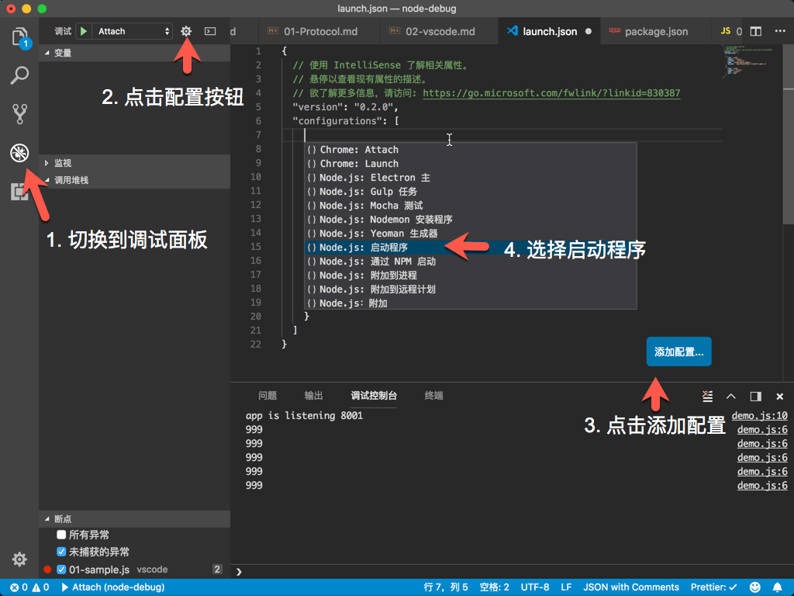
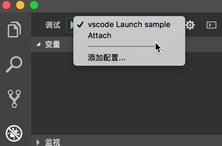
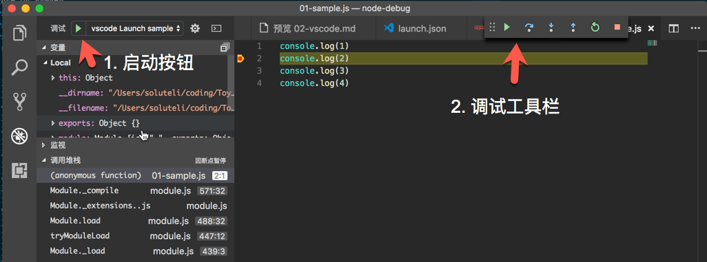
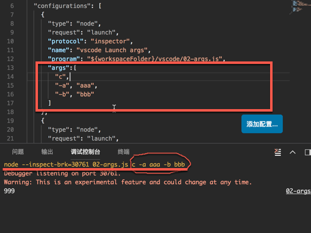
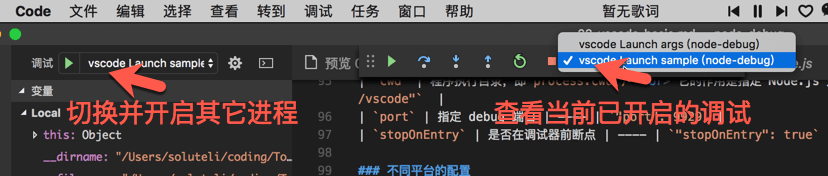

# JavaScript 调试  —— vscode 调试基础
vscode 内置了 node debug 环境，我们使用 vscode 调试时不需要借助其它调试工具。

## 基本调试介绍
**配置与启动**   
vscode 调试配置在 `./.vscode/launch.json` 文件中。   
我们可以可以通过如下方式创建：



创建的配置文件：
```json
{
  "version": "0.2.0",
  "configurations": [
    {
      "type": "node",
      "request": "launch",
      "name": "xxx",
      "program": "${workspaceFolder}/index.js"
    },
  ]
}
```

配置调试参数：
```diff
  {
    "version": "0.2.0",
    "configurations": [
      {
        "type": "node",
        "request": "launch",
-       "name": "xxx",
+       "name": "vscode Launch sample",
-       "program": "${workspaceFolder}/"
+       "program": "${workspaceFolder}/vscode/01-sample.js"
      },
    ]
  }
```
修改的目的有两个：
- 定义调试任务的名称："name"
- 配置待调试程序的入口："program"

接下来我们要在调试窗口选中调试任务： 



然后点击左侧绿色的启动按钮：   



如上图所示，如果出现调试工具栏则启动成功。具体的调试操作请查看 [vscode Debugging 文档](https://code.visualstudio.com/docs/editor/debugging)   

**vscode 调试原理**   
查看调试控制台，我们发现在启动调试时 vscode 在命令行执行了一段脚本：

```
/Users/soluteli/.nvm/versions/node/v7.9.0/bin/node --nolazy --debug-brk=29278 vscode/01-sample.js
```

由此可见，vscode 在启动调试时指定了 Node.js 的调试端口，并且本身作为一个调试工具接入了调试。


## 配置文件的具体介绍
上面介绍了 vscode 调试的基本方法，其中配置文件 `launch.json` 是最最为关键的，接下来我们来一起来学习x `launch.json` 各个参数的含义。

**配置文件的格式：**   
```json

{
  "version": "0.2.0",
  "configurations": [
    {
      "type": "node",
      "request": "launch",
      "protocol": "inspector",
      "name": "vscode Launch sample",
      "program": "${workspaceFolder}/vscode/01-sample.js"
    },
    ...
  ]
}
```
在配置文件中我们可以在 `configurations` 中有多个调试任务。每一个调试任务有许多配置项：

| 参数 | 含义 | 可选参数 | 示例 |
| ---- | ---- | ---- | ---- |
| `type` | 在 vscode 中，每一个调试扩展都提供了一个 `type` | 1. `node` - 内置的 node 调试器 <br/> 2. `php` - php 调试器 | ---- |
| `request` | 表示调试使用的请求方式 | 1. `launch` - 启动并监听调试：vscode 启动调试程序并且作为调试工具 <br/> 2. `attach` - 仅监听：vscode 仅作为调试工具监听已经启动的程序 | ---- |
| `program` | 制定调试程序的入口文件。 | ---- | `"program":"${workspaceFolder}/app.js"`<br/> `${workspaceFolder}`表示工作目录文件夹地址。 |
| `args` | 程序启动时的命令行参数 | ---- |   |
| `env` | 指定程序的环境变量，可用通过 `process.env` 获取 | ---- | 配置：` "env": { "level": "info" } ` <br>  程序文件： `console.log(process.env.level) // "info" ` |
| `cwd` | 程序执行目录，即`process.cwd()` <br> 它的作用是指定 Node.js 加载依赖模块的路径 | ---- | `"cwd": "${workspaceFolder}/vscode"`  |
| `port` | 指定 debug 端口 | ---- | `"port": 9929` |
| `stopOnEntry` | 是否在调试器前断点 | ---- | `"stopOnEntry": true` |

### 不同平台的配置
```json
"args": ["myFolder/path/app.js"],
"windows": {
    "args": ["myFolder\\path\\app.js"]
},
"linux": {

},
"osx": {

}

```

## 调试技巧
### 同时开启多个调试程序
我们可以使用 vscode 同时调试多个程序。
开启步骤：   
1. 先启动一个调试进程；
2. 切换调试面板，切换另一个任务，点击绿色启动按钮




### 快速开启多个程序
示例配置：
```
{
    "version": "0.2.0",
    "configurations": [
        {
            "type": "node",
            "request": "launch",
            "name": "Server",
            "program": "${workspaceFolder}/server.js",
            "cwd": "${workspaceFolder}"
        },
        {
            "type": "node",
            "request": "launch",
            "name": "Client",
            "program": "${workspaceFolder}/client.js",
            "cwd": "${workspaceFolder}"
        }
    ],
    "compounds": [
        {
            "name": "Server/Client",
            "configurations": ["Server", "Client"]
        }
    ]
}
```

## 参考链接
- [vscode 官方文档](https://code.visualstudio.com/docs/editor/debugging#_launchjson-attributes)
- [Visual Studio Code 前端调试不完全指南](http://jerryzou.com/posts/vscode-debug-guide/)
- [Debug in VSCode](https://blog.ymfe.org/Debug-in-vscode/)
